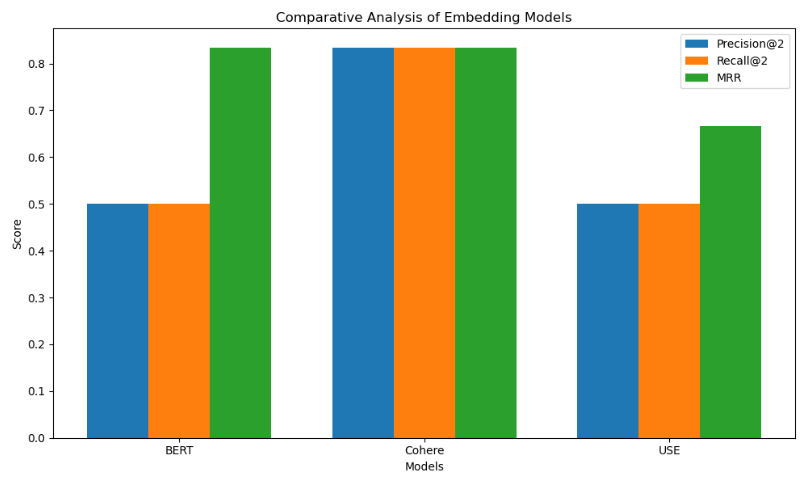

# Task1 - Retrieval (Search) System Evaluation

This project evaluates three embedding models—Universal Sentence Encoder (USE), BERT, and Cohere Embed v3—in a retrieval-based search system. The goal is to determine which model performs best for retrieving relevant documents based on query embeddings. Evaluation metrics include Precision@2, Recall@2, and Mean Reciprocal Rank (MRR).

## Project Structure

- **Dataset**: Synthetic dataset of queries and associated documents created for evaluating model performance.
- **Models**: 
  - **USE** (Universal Sentence Encoder)
  - **BERT** (Transformer-based model)
  - **Cohere Embed v3** (Proprietary embedding model)
- **Metrics**:
  - **Precision@2**: Measures the proportion of relevant documents in the top-2 results.
  - **Recall@2**: Assesses the retrieval of relevant documents within the top-2.
  - **MRR**: Focuses on ranking, evaluating the rank of the first relevant document in the result list.

## Key Findings

- **BERT**: Achieves the highest MRR score of 1.0, making it ideal for ensuring relevant documents appear at the top.
- **Cohere**: Provides balanced, high scores for both precision and recall, demonstrating reliable overall performance.
- **USE**: Underperforms across all metrics, suggesting limited effectiveness for this retrieval task.

## Usage

1. Clone the repository and navigate to the project directory.
2. Install dependencies using `pip install -r requirements.txt`.
3. Run the evaluation pipeline with `python Task1_Retrieval (Search) System Evaluation.py` to see model performance on the synthetic dataset.

## Visualization

The project includes a bar chart comparing model performance based on Precision@2, Recall@2, and MRR metrics.

## Detailed Results per Query

| Query                                  | Model   | Precision@2 | Recall@2 | MRR   |
|----------------------------------------|---------|-------------|----------|-------|
| Where was Elon Musk born?              | USE     | 0.5         | 0.5      | 0.5   |
| Where was Elon Musk born?              | BERT    | 0.5         | 0.5      | 0.5   |
| Where was Elon Musk born?              | Cohere  | 0.5         | 0.5      | 0.5   |
| What was Musk's childhood like?        | USE     | 0.5         | 0.5      | 0.5   |
| What was Musk's childhood like?        | BERT    | 0.5         | 0.5      | 1.0   |
| What was Musk's childhood like?        | Cohere  | 1.0         | 1.0      | 1.0   |
| How did Musk get interested in technology? | USE  | 0.5         | 0.5      | 1.0   |
| How did Musk get interested in technology? | BERT | 0.5         | 0.5      | 1.0   |
| How did Musk get interested in technology? | Cohere | 1.0       | 1.0      | 1.0   |

## Final Comparative Analysis

| Model  | Precision@2 | Recall@2 | MRR  |
|--------|-------------|----------|------|
| BERT   | 0.500       | 0.500    | 0.833|
| Cohere | 0.833       | 0.833    | 0.833|
| USE    | 0.500       | 0.500    | 0.667|

# Task 2 - Text Generation and Evaluation System

## Objective

This project aims to evaluate three language models—GPT-2, BART, and T5—in generating accurate responses to specific queries based on retrieved documents. Each model’s generated output is compared against a reference text using evaluation metrics to determine model performance and response accuracy.

## Approach

1. **Dataset**:
   - Three queries related to Elon Musk were used as prompts.
   - For each query, two relevant documents were retrieved to serve as input for the models.
   - Reference texts were manually created to provide a standard for evaluation.

2. **Text Generation**:
   - GPT-2, BART, and T5 were used to generate responses based on the concatenated content of two relevant documents per query.
   - The generated responses were then evaluated against the reference texts.

3. **Evaluation Metrics**:
   - **ROUGE**: Measures overlap of n-grams between generated text and reference text.
   - **BLEU**: Calculates precision of n-gram overlap to assess text fluency and relevancy.
   - **BERTScore**: Uses contextual embeddings to evaluate semantic similarity between generated and reference texts.

4. **Challenges and Solutions**:
   - Dataset creation was time-intensive due to a lack of pre-existing, tailored resources.
   - To enhance future comparisons, additional models (e.g., Ollama models like Mixtral, LLama) could be incorporated for broader evaluation.

## Results

Below is a summary of the evaluation results for each query and language model:

| Query                                | Model | ROUGE-1 | ROUGE-L | BLEU | BERTScore |
|--------------------------------------|-------|----------|----------|-------|-----------|
| Where was Elon Musk born?            | BART  | 0.425532 | 0.425532 | 0.244 | 0.919492  |
|                                      | GPT-2 | 0.232558 | 0.232558 | 0.099 | 0.885008  |
|                                      | T5    | 0.454545 | 0.454545 | 0.171 | 0.927223  |
| What was Musk's childhood like?      | BART  | 0.264151 | 0.188679 | 0.000 | 0.913298  |
|                                      | GPT-2 | 0.239130 | 0.152174 | 0.000 | 0.892665  |
|                                      | T5    | 0.333333 | 0.222222 | 0.000 | 0.922462  |
| How did Musk get interested in tech? | BART  | 0.571429 | 0.321429 | 0.137 | 0.906031  |
|                                      | GPT-2 | 0.344086 | 0.301075 | 0.089 | 0.885932  |
|                                      | T5    | 0.530612 | 0.448980 | 0.157 | 0.894565  |

## Conclusion

- **T5** performed best overall, with higher ROUGE and BERTScore metrics across most queries, indicating strong fluency and semantic relevance.
- **BART** also performed well, particularly in ROUGE scores, while **GPT-2** had the lowest scores overall, suggesting it may be less effective for factual generation tasks.
